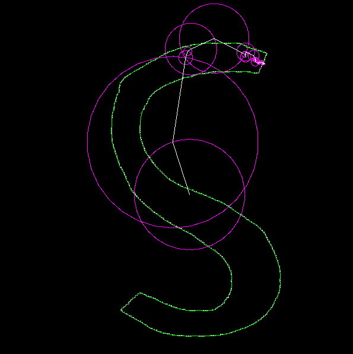

# Epicycles-SFML

Implementation of Discrete Fourier Transform in C++ using SFML (2.5.0).

Usage:

- Draw points with a mouse in a (somewhat) closed curve
- Press Spacebar to visualize epicycles going through the points

